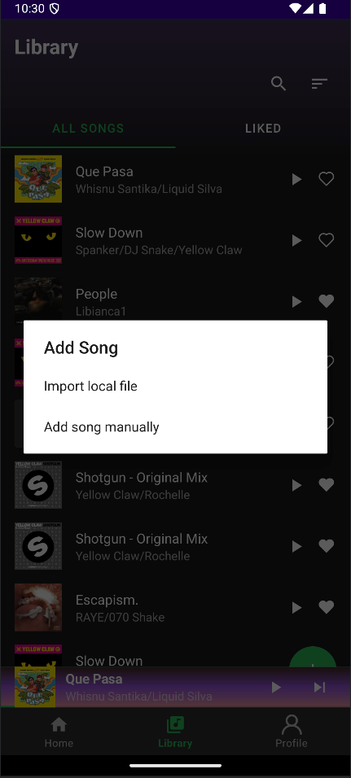

# Purrytify - Aplikasi Streaming Musik Revolusioner 🎵

## 📌 Deskripsi Aplikasi
**Purrytify** adalah aplikasi streaming musik yang dikembangkan untuk memenuhi tugas mata kuliah IF3210 Pengembangan Aplikasi Piranti Bergerak. Aplikasi ini terinspirasi dari cerita Purry yang berjuang melawan Dr. Asep Spakbor untuk mengembalikan musik ke dunia. Fitur utama:

- **Autentikasi**: Login dengan NIM & Token JWT
- **Manajemen Musik**: Upload/edit lagu dari penyimpanan eksternal
- **Pemutaran Lagu**: Play/Pause, Next/Previous, Mini Player
- **Koleksi Pribadi**: Liked Songs dan Library management
- **Keamanan**: JWT validation & Network sensing

---

## 📚 Tech Stack
### Library
- Hilt (DI)
- Retrofit + OkHttp (Networking)
- Room (Local Database)
- Media3 ExoPlayer & Android MediaPlayer (Audio Playback)
- Navigation Component
- Glide (Image Loading)
- Material Design
- ConstraintLayout
- Android Service (Background Playback)
- WorkManager (JWT Check)
- DataStore (Secure Storage)
- Timber (Logging)
- Coroutines + Flow (Async)
- LiveData (Reactive UI)

### Requirements
- Android Studio Giraffe (2022.3.1+)
- JDK 17+
- Device/Emulator (min API 29)

---

## 🖼️ Screenshot Fitur Utama
### Autentikasi
  
*Login dengan NIM ITB dan validasi JWT*

### Navigasi Utama
| Home | Library | Profile |
|------|---------|---------|
|  |  |  |

### Fitur Pemutaran
  
*Now Playing Page dengan kontrol lengkap*

  
*Mini Player yang selalu accessible*

### Manajemen Lagu
  
*Form upload lagu dengan metadata*


---

## 👥 Pembagian Kerja & Timeline
| Nama                         | NIM    | Kontribusi Utama  | Total Jam |
|------------------------------|--------|-------------------|-----------|
| Mohammad Nugraha Eka Prawira |13522001|                   |           |
| Kharris Khisunica            |13522051|                   |           |
| Fabian Radenta Bangun        |13522105|                   |           |

---

## 🚀 Deployment Guide

### Langkah Instalasi
1. Clone repository:
   ```bash
   git clone https://github.com/Labpro-21/if3210-2025-mad-bnz.git
2. Masuk ke directory repo:
    ```bash
   cd if3210-2025-mad-bnz
3. Pastikan sudah memiliki *device* sesuai prasyarat pada Android Studio
4. Jalankan program dengan klik tombol Run